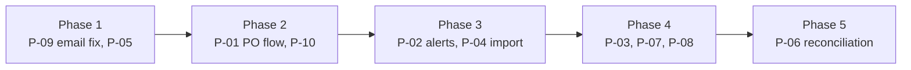

# DMS Parts Module — Replit Build Spec

Sep 25, 2026 · @Uday Kumar

## Context & instructions for Replit Agent

Build 10 enhancements to the existing Parts & Inventory module of the CAM Motors / GT Automotive Dealer Management System (DMS), based on client feedback logged 09/18 and 09/23/2026. These extend the current app; they are not a rewrite.

**Build rules**

- Work inside the existing codebase. Reuse the current stack, ORM, auth, UI components and styling. Do not introduce a new framework.
- Inspect existing Parts, Inventory, Supplier, Customer, Service/Repair Order and Invoice models before adding tables. Extend them where they exist; create new ones only where missing.
- All schema changes go through migrations. No destructive changes to existing columns.
- Currency is GYD by default. Store money as integer minor units or fixed-point decimal, never float.
- Every new action that changes state (send, approve, receive, reconcile, invoice) writes an audit log entry with user, timestamp, and before/after status.
- Respect multi-branch and multi-tenant scoping already in the app: every new record carries branch\_id (and tenant\_id if present) and every query filters on it.
- Deliver in the order in the Build order section. After each feature, run the app, verify its acceptance criteria, and summarize what changed.
- If an existing feature already covers part of a requirement, report it and extend it rather than duplicating.

## Requirements summary

One item is High priority (special-order arrival alerts); one is Medium; eight were logged without a priority and are treated as Medium here.

| ID | Requirement | Requested by | Logged | Priority |
| --- | --- | --- | --- | --- |
| P-01 | Create parts orders; a user reviews and sends to supplier | Faraz | 09/18/2026 | Medium |
| P-02 | Automated SMS / internal alert to advisors and managers when special-order parts arrive | Faraz | 09/18/2026 | High |
| P-03 | Separate Shipping and Duties line items on parts estimates | Alheit | 09/23/2026 | Unset |
| P-04 | Import a parts order file to populate the system | Alheit | 09/23/2026 | Unset |
| P-05 | Show part name in cycle count and analysis | Faraz | 09/23/2026 | Unset |
| P-06 | Upload supplier purchase invoice and reconcile against PO | Faraz | 09/23/2026 | Unset |
| P-07 | Generate an invoice from a parts requisition | Faraz | 09/23/2026 | Unset |
| P-08 | Generate an invoice to the customer who requested a part | Faraz | 09/23/2026 | Unset |
| P-09 | Verify the PO email actually sends | Faraz | 09/23/2026 | Unset (bug check) |
| P-10 | Preview the supplier email before sending a parts request | Faraz | 09/23/2026 | Unset |

## Data model additions

Add or extend these entities. Names are suggestions; match existing naming conventions.

| Entity | Key fields | Used by |
| --- | --- | --- |
| PurchaseOrder | id, po\_number (auto, per branch), supplier\_id, branch\_id, status, created\_by, reviewed\_by, sent\_at, expected\_date, subtotal, shipping\_amount, duties\_amount, total, notes, source (manual / import) | P-01, P-04, P-06, P-09, P-10 |
| PurchaseOrderLine | id, po\_id, part\_id, part\_number, part\_name, qty\_ordered, qty\_received, unit\_cost, is\_special\_order, requisition\_line\_id (nullable), customer\_id (nullable), repair\_order\_id (nullable) | P-01, P-02, P-04, P-06 |
| SupplierInvoice | id, supplier\_id, po\_id, invoice\_number, invoice\_date, file\_url, subtotal, shipping\_amount, duties\_amount, tax\_amount, total, reconciliation\_status, reconciled\_by, reconciled\_at | P-06 |
| SupplierInvoiceLine | id, supplier\_invoice\_id, po\_line\_id (nullable), part\_number, description, qty, unit\_cost, match\_status (matched / qty\_variance / price\_variance / unmatched) | P-06 |
| PartsRequisition (extend) | add invoice\_id, invoiced\_at | P-07 |
| PartsEstimate / Estimate (extend) | add shipping\_amount, duties\_amount as separate lines | P-03 |
| CustomerInvoice (extend) | add source\_type (requisition / special\_order / counter\_sale / repair\_order), source\_id | P-07, P-08 |
| EmailLog | id, entity\_type, entity\_id, to, cc, subject, body\_html, attachments, status (queued / sent / failed), provider\_message\_id, error, sent\_at, sent\_by | P-09, P-10 |
| Notification | id, type, recipient\_user\_id, channel (sms / in\_app), message, entity\_type, entity\_id, status, sent\_at, read\_at, error | P-02 |
| ImportJob | id, file\_name, file\_url, type (parts\_order), status, rows\_total, rows\_ok, rows\_failed, error\_report\_url, created\_by | P-04 |
| Supplier (extend) | ensure email, cc\_emails, contact\_name exist | P-01, P-10 |

## Feature specs

### P-01 Parts order creation with review before send

As a parts clerk, I create a parts order; a parts manager reviews it before it goes to the supplier.

- New screen Parts > Purchase Orders with list (filter by status, supplier, branch, date) and create/edit form.
- Form: supplier, expected date, line items (search part by number or name, qty, unit cost defaulting to last cost), notes, special-order flag per line with optional customer and repair order link.
- Statuses: Draft > Pending Review > Approved > Sent > Partially Received > Received > Closed; Cancelled from any status before Sent.
- Submitter clicks Submit for Review. Reviewer can Approve, Return to Draft with a comment, or Cancel. Reviewer cannot be the creator unless the user has an override permission.
- Approved POs show Preview & Send (P-10). Sending generates a PDF of the PO and emails it (P-09).
- Receiving screen: enter qty received per line; stock on hand increases; partial receipts allowed.

Acceptance criteria

- [ ] A PO cannot be emailed until it is Approved.
- [ ] Returning a PO to Draft records the reviewer comment and notifies the creator in-app.
- [ ] Receiving updates qty\_received, on-hand stock, and PO status correctly for partial and full receipts.

### P-02 Special-order arrival notifications (High)

When a special-order part is received, the service advisor and manager are alerted automatically.

- Trigger: a PO line with is\_special\_order = true gets qty\_received > 0.
- Recipients: the advisor on the linked repair order (or the user who created the special order), plus users with the Parts Manager and Service Manager roles for that branch.
- Channels: in-app notification always; SMS if the recipient has a mobile number and SMS is enabled in settings. Reuse the existing SMS gateway integration if one exists; otherwise build a provider interface with a stub.
- Message: "Special-order part \[part name\] (\[part number\]) x\[qty\] received for \[customer\] / RO \[number\] at \[branch\]."
- Optional setting (off by default): also SMS the customer.
- Admin settings: toggle per channel and per role.

Acceptance criteria

- [ ] Receiving a special-order line creates one notification per recipient per channel within 1 minute.
- [ ] Failed SMS sends are logged with error and retried up to 3 times.
- [ ] Non-special-order receipts send nothing.

### P-03 Shipping and Duties on parts estimates

- Add two separate lines on the parts estimate: Shipping and Duties, each an editable amount (default 0).
- Show them below parts subtotal and above tax/total on screen and on the estimate PDF.
- Carry both lines through when an estimate converts to an invoice.

Acceptance criteria

- [ ] Estimate total = parts subtotal + shipping + duties + tax (tax rules unchanged).
- [ ] Shipping and Duties print on the PDF only when non-zero (see open questions).

### P-04 Import a parts order

- Upload CSV or XLSX on the Purchase Orders screen. Provide a downloadable template.
- Template columns: supplier\_code, part\_number, part\_name, qty, unit\_cost, special\_order (Y/N), customer\_ref, ro\_number.
- Unknown part numbers: offer to create the part or skip the row.
- Show a preview with per-row validation before committing. Import creates a Draft PO (or one PO per supplier if multiple suppliers).

Acceptance criteria

- [ ] Invalid rows are listed with the reason and can be downloaded as an error file.
- [ ] Nothing is written until the user confirms the preview.
- [ ] Imported POs are marked source = import and follow the normal review flow.

### P-05 Part name in cycle count and analysis

- Add a Part Name column next to Part Number on the cycle count sheet, count entry screen, variance analysis report, and their exports (PDF/CSV).
- Make it searchable and sortable.

Acceptance criteria

- [ ] Every cycle count view and export shows part name.

### P-06 Supplier invoice upload and reconciliation

- On a PO, Upload Supplier Invoice: attach PDF/image and enter header (invoice number, date, shipping, duties, tax, total) and lines. Lines may be pre-filled from PO lines for editing.
- Auto-match invoice lines to PO lines by part number. Flag qty variance (invoiced vs received) and price variance (invoice unit cost vs PO unit cost) beyond a configurable tolerance (default 0).
- Reconciliation screen: side-by-side PO / received / invoiced per line with match status; user can accept variances with a reason, then Mark Reconciled.
- On reconcile, update part average/last cost from invoice cost (landed cost including allocated shipping and duties, pro-rata by line value).

Acceptance criteria

- [ ] Duplicate invoice number for the same supplier is blocked.
- [ ] A PO cannot be Closed while it has an unreconciled invoice.
- [ ] Variances and accepted reasons appear in the audit log.

### P-07 Invoice from a parts requisition

- On a parts requisition, add Generate Invoice. Creates a customer invoice with requisition lines, prices from the price list, and links back via source\_type = requisition.
- A requisition can be invoiced once; show the invoice number on the requisition afterwards.

Acceptance criteria

- [ ] Generating twice is blocked with a link to the existing invoice.
- [ ] Invoice lines, quantities and prices match the requisition.

### P-08 Invoice to the customer who requested a part

- For special-order lines linked to a customer, add Invoice Customer from the PO line, the receiving screen, or the customer record.
- Pre-fill customer, part, qty, selling price, and any shipping/duties from the estimate (P-03). Apply any deposit already taken.
- Email or print the invoice using the existing invoice template.

Acceptance criteria

- [ ] Invoice is linked to both the customer and the originating PO line.
- [ ] A special-order line cannot be invoiced twice.

### P-09 Verify PO email sending (bug check)

- Trace the current PO email path end to end: trigger, template, recipient resolution, provider config, and error handling. Report findings before changing anything.
- Fix the root cause. Route all outgoing PO emails through EmailLog with status and provider response.
- Add a Resend action on a Sent PO and show the email status and timestamp on the PO.

Acceptance criteria

- [ ] Sending a PO produces a sent EmailLog entry with a provider message id, and the supplier receives it with the PDF attached.
- [ ] A provider failure shows a visible error to the user and leaves the PO in Approved, not Sent.

### P-10 Preview supplier email before sending

- Preview & Send opens a modal with To (supplier email), CC (supplier cc\_emails plus current user), subject, body, and the attached PO PDF.
- To, CC, subject and body are editable; changes apply to this send only.
- Default template is editable by admins in settings, with placeholders for PO number, supplier name, branch, expected date, and sender name.

Acceptance criteria

- [ ] The email received matches the preview exactly, including attachment.
- [ ] The final sent content is stored in EmailLog.

## Cross-cutting requirements

**Roles and permissions** (add to the existing permission system)

| Permission | Parts Clerk | Parts Manager | Service Advisor | Service Manager | Admin |
| --- | --- | --- | --- | --- | --- |
| Create / edit draft PO | Yes | Yes | No | No | Yes |
| Review / approve PO | No | Yes | No | No | Yes |
| Send PO email | No | Yes | No | No | Yes |
| Receive parts | Yes | Yes | No | No | Yes |
| Upload / reconcile supplier invoice | No | Yes | No | No | Yes |
| Generate customer invoice (P-07, P-08) | Yes | Yes | Yes | Yes | Yes |
| Import parts order | Yes | Yes | No | No | Yes |
| Edit email templates and notification settings | No | No | No | No | Yes |

**Email**

- One email service used by all features, with a provider abstraction and config from environment secrets (never hard-coded).
- Every send writes an EmailLog row. Failures surface in the UI.

**Notifications**

- In-app bell with unread count, list, and mark-as-read. SMS through a provider interface.
- Store all notifications, including failures.

**Documents**

- PO PDF and invoice PDF use the branch letterhead, logo, address and contact details already configured.
- Uploaded files (supplier invoices, imports) go to the app's existing file storage, scoped by tenant and branch, max 10 MB, types PDF, JPG, PNG, CSV, XLSX.

**Audit**

- Log status changes, sends, approvals, reconciliations, variance acceptances and invoice generation.

**Testing**

- Seed data: 2 suppliers, 20 parts, 1 special-order customer with an RO, one user per role.
- Add automated tests for PO status transitions, reconciliation matching, landed-cost allocation and duplicate-invoice guards.

## Build order and open questions

Build in five phases so the email bug is diagnosed first and the High-priority alert ships early.

P-05 is a quick win bundled with the email investigation; P-06 comes last because it depends on POs, receiving and landed cost.

**Assumptions**

- Unset priorities are treated as Medium.
- Shipping and Duties are not taxed; tax rules are otherwise unchanged.
- Landed cost allocates shipping and duties pro-rata by line value.

**Open questions for the client (Faraz, Alheit)**

- [ ] P-02: Should customers also get an SMS when their special-order part arrives?
- [ ] P-03: Show Shipping and Duties on the estimate when the amount is zero?
- [ ] P-03: Are Shipping and Duties taxable?
- [ ] P-04: What file format do suppliers send today? A sample file would fix the template.
- [ ] P-06: Acceptable price and qty variance tolerance before a manager must approve?
- [ ] P-07 vs P-08: Is a requisition an internal transfer (e.g. to a repair order) or always customer-facing? This decides whether P-07 invoices a customer or posts an internal charge.
- [ ] P-09: Which email provider and sender address should POs come from?
